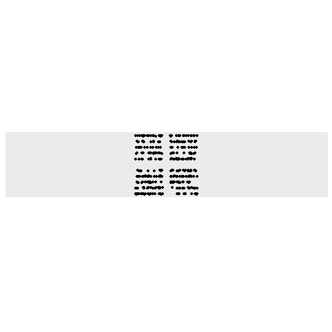

```{r setup, include=FALSE}
library(gganimate)
library(gifski)
library(ggplot2)
library(reshape2)
library(knitr)
library(dplyr)
library(stringr)
library(tidyverse)
library(readr)
library(collections)
options(scipen = 999)
```

```{r}
input<-read_lines("Day10Sample.txt")
#input<-read_lines("../../AoCData/AOC2018/Day10.txt")
starframe<-as.data.frame(matrix(ncol=4,nrow=0))
for(i in 1:length(input)){
  star<-input[i]
  star<-str_replace_all(star,"position=|\\<|\\>"," ")
  star<-str_replace_all(star,"velocity=",",")
  star<-str_replace_all(star," ","")
  star<-as.numeric(unlist(str_split(star,",")))
  starframe<-rbind(starframe,star)
}
colnames(starframe)<-c("x","y","vx","vy")
```


## Part 1
Move them until its worth looking closely.
Animate it.

```{r}

shrinkdown<-function(df){
  ## at most, 5 between each one - so spit it out when there's only so much space
  ## (also, I tried farther away and that was a horrible mistake)
  dfarea<-abs(max(df$x)-min(df$x)*max(df$y)-min(df$y))
  t<-1
  while(dfarea>
        nrow(df)^2){
    df<-df%>%rowwise%>%
      mutate(newx=x+vx,newy=y+vy)%>%
      mutate(x=newx,y=newy)%>%
      select(x,y,vx,vy)
    t<-t+1
    dfarea<-abs(max(df$x)-min(df$x)*max(df$y)-min(df$y))
    if(t%%1000000==0){cat(dfarea,"\n")}
    }
  df}

```


```{r}
tightstar<-shrinkdown(starframe)
```

```{r}
starchart<-function(df){
  animdf<-df%>%
    mutate(t=0)%>%
    select(x,y,t)
  tm<-0
  keepgoing<-TRUE
  xranges<-max(df$x)-min(df$x)
  yranges<-min(df$y)-min(df$y)
  while(keepgoing){
    df<-df%>%rowwise%>%
      mutate(newx=x+vx,newy=y+vy)%>%
      mutate(x=newx,y=newy)%>%
      select(x,y,vx,vy)
    ### if it's growing, stop
    if((max(df$x)-min(df$x))>xranges&&max(df$y)-min(df$y)>yranges){
      keepgoing<-FALSE
      break}
    ### otherwise, add this to the animlist
    tm<-tm+1
    addit<-df %>%
      mutate(t=tm)%>%
      select(x,y,t)
    animdf<-rbind(animdf,addit)
    xranges<-max(df$x)-min(df$x)
    yranges<-min(df$y)-min(df$y)
    
    }
animdf}
```

```{r}
starpaths<-starchart(tightstar)
```


```{r,echo=FALSE,message=FALSE,eval=FALSE}
### find the aspect ratio:
mt<-max(starpaths$t)
mt<-starpaths%>%rowwise%>%filter(t==mt)
ar<-((max(mt$x)-min(mt$x)+4)/(max(mt$y)-min(mt$y)+4))
### plot
staranim<-ggplot()+
  geom_point(data=starpaths,aes(x=x,y=y))+
  theme(axis.text.x = element_blank(),
        axis.ticks.x = element_blank(),
        axis.text.y = element_blank(),
        axis.ticks.y = element_blank(),
        axis.title.y = element_blank(),
        axis.title.x = element_blank(),
        panel.grid.major = element_blank(),
        panel.grid.minor = element_blank(),
        legend.position="none")+
  scale_x_reverse()+
  scale_y_reverse()+
  coord_fixed()+
  transition_states(t,wrap=FALSE)+
  view_follow(aspect_ratio = ar)


showthestars<-animate(staranim,renderer = gifski_renderer(),end_pause=30)

showthestars


#anim_save("day10part1.gif",showthestars)

```

I do not know why this is backwards.  Everything I've tried to make it not backwards has failed




## Part 2
Count the number of transforms:  (or, because we know the final position of each one - just do the math)

```{r}

countshrink<-function(df){
  ## at most, 5 between each one - so spit it out when there's only so much space
  ## (also, I tried farther away and that was a horrible mistake)
  dfarea<-abs(max(df$x)-min(df$x)*max(df$y)-min(df$y))
  t<-1
  keepgoing<-TRUE
  xranges<-max(df$x)-min(df$x)
  yranges<-min(df$y)-min(df$y)
  while(keepgoing){
    df<-df%>%rowwise%>%
      mutate(newx=x+vx,newy=y+vy)%>%
      mutate(x=newx,y=newy)%>%
      select(x,y,vx,vy)
    if((max(df$x)-min(df$x))>xranges&&max(df$y)-min(df$y)>yranges){
      keepgoing<-FALSE
      break}
    xranges<-max(df$x)-min(df$x)
    yranges<-min(df$y)-min(df$y)
    t<-t+1}
  cat(t,"\n")
  ### -1 because it stops when it starts expanding
  t-1}

```

```{r}
##
part2<-countshrink(starframe)-1
part2
```

