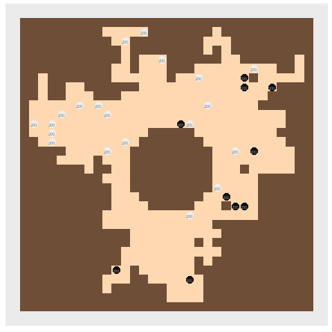

```{r setup, include=FALSE}
library(gifski)
library(gganimate)
library(ggplot2)
library(reshape2)
library(knitr)
library(dplyr)
library(stringr)
library(tidyverse)
library(readr)
library(collections)
options(scipen = 999)
```

```{r}
input<-read_lines("Day15Sample1.txt")
```

Read the data in - if a cave wall, put it into hte matrix.
If it is a goblin or elf, put it into a dataframe

```{r}
cave<-matrix(NA,nrow=length(input),ncol=nchar(input[1]))
unitframe<-as.data.frame(matrix(nrow=0,ncol=3))
for(y in 1:length(input)){
  ly<-unlist(str_split(input[y],""))
  for(x in 1:nchar(input[1])){
    ### if it is a cave wall, put it in the cave
    if(ly[x]=="#"){cave[y,x]<-"#"}else{cave[y,x]<-"."}
    if(ly[x]=="G"|ly[x]=="E"){
      unitframe<-rbind(unitframe,list(ly[x],x,y))}}}
colnames(unitframe)<-c("team","x","y")
unitframe<-cbind(unitframe,hp=rep(200,nrow(unitframe)))
```


This function takes in the elves/goblin dataframe, cave(matrix), the number of rounds, and (for part 2, a boost to the elf attack)

```{r}
goblinattack<-function(geunits,cv,r,ea){
  animdf<-geunits%>%select("team","x","y","hp")%>%mutate(round=0)
  colnames(animdf)<-c("team","x","y","hp","round")
  roundcount<-0
  keepgoing<-TRUE
  while(keepgoing&&roundcount<r){
    ### at the beginning of each round, print the round number and how many elves & goblins.
    cat(roundcount+1,"elfcount: ",length(which(geunits$team=="E"))," goblincount: ",length(which(geunits$team=="G")),"\n")
    ## find G targets, if none, E wins - next
    if(all(geunits$team!="G")){
      winner<-"E"
    break}
    ## find E targets, if none, G wins - next
    if(all(geunits$team!="E")){
      winner<-"G"
      break}
    ## sort in reading order and enumerate those
    geunits<-geunits %>% rowwise %>%
      arrange(y,x)%>%ungroup%>%
      mutate(srtordr=row_number())
    ## each unit takes a turn and moves and attacks
    i<-1
    while(i<=nrow(geunits)){
      turnabout<-unitturn(geunits[which(geunits$srtordr==i),],geunits[-which(geunits$srtordr==i),],cv,ea)
      geunits<-turnabout[[1]]
      ### if there are no enemies left, end
      if(turnabout[[2]]==T){
        keepgoing<-FALSE
        break}
      i<-i+1}
    #### this is purely for creating the animation - not needed
    animdf<-rbind(animdf,
                  geunits%>%select("team","x","y","hp")%>%mutate(round=roundcount+1))
    ### filter out dead goblins and elves
    geunits<-as.data.frame(geunits)%>% rowwise %>%filter(team!="D")%>%arrange(y,x)
    if(keepgoing==FALSE){break}
    ### update the round count
    roundcount<-roundcount+1}
  ### the answer to p1 is the units' combined hit points * the roundcount
  p1answer<-sum(geunits$hp)*roundcount
  cat("remaining hit points: ",sum(geunits$hp)," total rounds: ",roundcount," outcome: ",p1answer,"\n")
  list(geunits,p1answer,animdf)}
```

This is the main body of the turn, it performs the move and the attack:

```{r}
unitturn<-function(u,allunits,c,elfattack){
  ## if for some reason, the unit is not marked as dead, mark it as dead.
  if(u$hp<=0){
    u$team<-"D"
    allunits<-rbind(allunits,u)
    return(list(allunits,F))}
  ### mark the attack power and label the enemies
  if(u$team=="E"){
    enemy<-"G"
    attackpower<-elfattack
  }else if(u$team=="G"){
    enemy<-"E"
    attackpower<-3}
  ## update cave&get list of enemy all the blank spaces around all of the enemies
  if(!any(allunits$team==enemy)){
    allunits<-rbind(allunits,u)
    return(list(allunits,T))}
  surrounds<-c()
  for(i in 1:nrow(allunits)){
    ### add things to the caves
    if(allunits$team[i]!="D"){c[allunits$y[i],allunits$x[i]]<-allunits$team[i]}}
  ### get list of surrounding spaces
  for(i in 1:nrow(allunits)){
    if(allunits$team[i]==enemy){
      if(c[allunits$y[i],allunits$x[i]+1]=="."){surrounds<-c(surrounds,paste(allunits$x[i]+1,allunits$y[i]))}
      if(c[allunits$y[i],allunits$x[i]-1]=="."){surrounds<-c(surrounds,paste(allunits$x[i]-1,allunits$y[i]))}
      if(c[allunits$y[i]+1,allunits$x[i]]=="."){surrounds<-c(surrounds,paste(allunits$x[i],allunits$y[i]+1))}
      if(c[allunits$y[i]-1,allunits$x[i]]=="."){surrounds<-c(surrounds,paste(allunits$x[i],allunits$y[i]-1))}}}
  surrounds<-unique(surrounds)
  ### if the unit is next to an enemy stay there - otherwise begin moving
  aroundu<-(all(c[u$y+1,u$x]!=enemy,
                c[u$y-1,u$x]!=enemy,
                c[u$y,u$x+1]!=enemy,
                  c[u$y,u$x-1]!=enemy))
  ### find the shortest path to a blank space & return the space
  if(aroundu&&length(surrounds)>0){
    targetspace<-closestspace(u,surrounds,c)
    ### if there is no blank space, stay still
    if(all(!is.na(targetspace))){
      ### otherwise, take one step in the direction via the shortest path
      u<-closestdirection(u,targetspace,c)}}
  ### discover if the unit is next to an enemy 
  attack<-allunits%>%rowwise%>%
    filter((y==u$y-1&x==u$x)|(y==u$y&x==u$x-1)|(y==u$y&x==u$x+1)|(y==u$y+1&x==u$x))%>%
    filter(team==enemy)%>%
    ### arrange by hit points, y, then x
    arrange(hp,y,x)
  ### if there's anything there, attack it.
  if(nrow(attack)>=1){
    attack<-attack[1,]
    attack<-unlist(attack$srtordr)
    ### lower the hitpoints
    allunits$hp[which(allunits$srtordr==attack)]<-allunits$hp[which(allunits$srtordr==attack)]-attackpower}
  ### add the unit back to the group of units
  allunits<-rbind(allunits,u)
  ### mark the dead units
  allunits<-allunits%>%rowwise%>%
    mutate(team=ifelse(hp<=0,"D",team))
  ### return for the next run
  list(allunits,F)}
```

Takes in unit & list of enemy blank spaces.  Gives back the space with the shortest path to it (by reading direction).  Standard BFS 

```{r}
## BFS
closestspace<-function(u,l,fullcave){
  beenthere<-dict()
  pq<-priority_queue()
  ### the list is x, y, and distance traveled
  pq$push(c(u$x,u$y,0),0)
  ### start with an infinite shortest path
  splength<-Inf
  target<-list()
  while(pq$size()>0){
    curr<-pq$pop()
    ### This could likely be a break, but for now, if the path is longer than the shortest path, stop
    if(curr[3]>splength){
      next}
    ###if the path is shorter than the shortest path & the shortest path is infinite, flag
    ### this should never happen - but in case it does, I want to know
    if(curr[3]<splength&splength<Inf){cat("*found shorter shortest path*\n")}
    ### Is this one of the surrounding blank spaces?
    if(paste(curr[1],curr[2])%in%l){
      ### list this as a possible closest space
      target<-unique(c(target,list(c(curr[1],curr[2]))))
      ### update the shortest path length
      splength<-curr[3]
      next}
    ### if this is either a wall, *living* elf, or *living* goblin, next 
    if(!(fullcave[curr[2],curr[1]]%in%c(".","D"))){next}
    ### if this is a space that has been before, next
    if(beenthere$has(paste(curr[1],curr[2]))){next}
    ### else, mark as having been before
    beenthere$set(paste(curr[1],curr[2]),curr[3])
    ### add a step in each direction to the queue
    pq$push(c(curr[1]+1,curr[2],curr[3]+1),-curr[3]-1)
    pq$push(c(curr[1]-1,curr[2],curr[3]+1),-curr[3]-1)
    pq$push(c(curr[1],curr[2]+1,curr[3]+1),-curr[3]-1)
    pq$push(c(curr[1],curr[2]-1,curr[3]+1),-curr[3]-1)}
  ### if there is no shortest target, return NA.  Unit turn will not move 
  if(length(target)==0){
    return(NA)}
  ### if there is only one closest square
  if(length(target)==1){
    ### return that to the unit turn - to start moving there
    return(unlist(target))}
  ### otherwise, find the closest to the top -of the page for reading order 
  lowy<-min(sapply(target,function(x){x[2]}))
  ### filter to just the the targets closest to the top:
  target<-target[sapply(target,function(x){x[2]==lowy})]
  ### again, if there is only one - return that one
  if(length(target)==1){
    return(unlist(target))}
  ### finally, find the target that is furthest to the left
  lowx<-min(sapply(target,function(x){x[1]}))
  target<-target[sapply(target,function(x){x[1]==lowx})]
  ### return that one.
  return(unlist(target))}
```

This should figure out which direction should be the first step to the blank space.  Again, a standard BFS.

```{r}
closestdirection<-function(u,t,fullcave){
  beenthere<-dict()
  pq<-priority_queue()
  ### push in 4 directions, labeled up, down, left, & right - in reading order
  ##up==1, left==2, right==3, down==4
  ### it tracks location, number of steps, and starting direction
  pq$push(c(u$x,u$y-1,0,1),0)
  pq$push(c(u$x-1,u$y,0,2),0)
  pq$push(c(u$x+1,u$y,0,3),0)
  pq$push(c(u$x,u$y+1,0,4),0)
  ### start with a starting distance of infinite
  splength<-Inf
  fd<-c()
  while(pq$size()>0){
    curr<-pq$pop()
    ### if we are further away than the shortest distance - get the next one
    ### this could/should probably be a break, but to be certain
    if(curr[3]>splength){next}
    ### if for some reason, a shorter distance is found after the shortest distance has been found, flag
    ### this, too, should never happen
    if(curr[3]<splength&splength<Inf){cat("*found closer closest direction*\n")}
    ### if reached the target
    if(curr[1]==t[1]&&curr[2]==t[2]){
      ### update the list of possible shortest directions
      fd<-c(fd,curr[4])
      ### update the shortest distance length
      splength<-curr[3]
      next}
    ### if this is a wall, goblin, or elf, stop
    if(!(fullcave[curr[2],curr[1]]%in%c(".","D"))){next}
    ### if been there before (from the same starting direction), stop
    if(beenthere$has(paste(curr[1],curr[2],curr[4]))){next}
    ### otherwise, mark that it's been there before
    beenthere$set(paste(curr[1],curr[2],curr[4]),curr[3])
    ### push in every direction
    pq$push(c(curr[1]+1,curr[2],curr[3]+1,curr[4]),-curr[3]-1)
    pq$push(c(curr[1]-1,curr[2],curr[3]+1,curr[4]),-curr[3]-1)
    pq$push(c(curr[1],curr[2]+1,curr[3]+1,curr[4]),-curr[3]-1)
    pq$push(c(curr[1],curr[2]-1,curr[3]+1,curr[4]),-curr[3]-1)}
  ### of the possible final directions, get the one first in reading order
  fd<-min(fd)
  ### based on that, pick the step to move to
  switch(fd,
         "1"=u$y<-u$y-1,
         "2"=u$x<-u$x-1,
         "3"=u$x<-u$x+1,
         "4"=u$y<-u$y+1,
         cat("bad fd\n"))
  ### return the space to move to 
  u}
  
```

Finally run:

```{r}
p1<-goblinattack(unitframe,cave,100,3)
#animdf<-as.data.frame(p1[[3]])
part1<-p1[[2]]
part1
```


```{r,eval=FALSE,echo=FALSE}
cavecolors<-c(.="#FED8B1","#"="#6F4E37")
unitcolors<-c(E="#111111",G="#EEEEEE",D="#FF0000")
cavegframe<-melt(cave)
cavegraph<-ggplot()+
  scale_fill_manual(values=cavecolors)+
    scale_color_manual(values=unitcolors)+
  geom_tile(data=cavegframe,aes(x=Var2,y=Var1,fill=value))+
  theme(axis.text.x = element_blank(),
        axis.ticks.x = element_blank(),
        axis.text.y = element_blank(),
        axis.ticks.y = element_blank(),
        axis.title.y = element_blank(),
        axis.title.x = element_blank(),
        panel.grid.major = element_blank(),
        panel.grid.minor = element_blank(),
        legend.position="none")+
  scale_y_reverse()+
  coord_fixed()
cavegraph

```
!

```{r,eval=FALSE,echo=FALSE,}
eggraph<-cavegraph+
  geom_point(data=animdf,aes(x=x,y=y,color=team),size=5)+
  geom_text(data=animdf,aes(x=x,y=y,label=hp,color="#0000FF"),size=2)+
  transition_states(round,wrap=FALSE)

egp1anim<-animate(eggraph,nframes=max(animdf$round)+1,renderer = gifski_renderer(),end_pause=15)
egp1anim
```



## Part 2 - 

Mostly the same as the above

```{r}
goblinattack2<-function(geunits,cv,r,ea){
  roundcount<-0
  keepgoing<-TRUE
  while(keepgoing&&roundcount<r){
    ## find G targets, if none, E wins - next
    if(all(geunits$team!="G")){
      winner<-"E"
      break}
    ## find E targets, if none, G wins - next
    if(all(geunits$team!="E")){
      winner<-"G"
      break}
    ## sort in reading order and enumerate those
    geunits<-geunits %>% rowwise %>%
      arrange(y,x)%>%ungroup%>%
      mutate(srtordr=row_number())
    ## each unit takes a turn
    i<-1
    while(i<=nrow(geunits)){
      turnabout<-unitturn(geunits[which(geunits$srtordr==i),],geunits[-which(geunits$srtordr==i),],cv,ea)
      geunits<-turnabout[[1]]
      if(turnabout[[2]]==T){
        keepgoing<-FALSE
        break}
      i<-i+1}
    ## after all have moved, filter out dead guys
    geunits<-as.data.frame(geunits)%>% rowwise %>%filter(team!="D")%>%arrange(y,x)
    if(keepgoing==FALSE){break}
    #    ## update the round count
    roundcount<-roundcount+1
  }
  p2answer<-sum(geunits$hp)*roundcount
  cat("total elves: ",length(which(geunits$team=="E")),"remaining hit points: ",sum(geunits$hp)," total rounds: ",roundcount," outcome: ",p2answer,"\n")
  list(geunits,p2answer)}
```

Weakest Elf random searches its way down to the weakest elf

```{r}
weakestelf<-function(geunits,cv,r){
  elfpower<-4
  anotherround<-TRUE
  elftotal<-length(which(geunits$team=="E"))
  cat("starting elves: ",elftotal,"\n")
  minep<-elfpower
  ### double until the the elfpower is high enough to save all elves
  while(anotherround){
    cat(elfpower," - ")
    attempt<-goblinattack2(unitframe,cave,r,elfpower)
    ### if all elves saved - 
    if(length(which(attempt[[1]]$team=="E"))==elftotal){
      ### make that the upper limit & the outcome the possible answer
      outcome<-attempt[[2]]
      anotherround<-FALSE
      break}
    ### otherwise, that's a lower limit and double
    minep<-elfpower
    elfpower<-elfpower*2}
  maxep<-elfpower
  ### so long as there's distance between up and lower bounds
  while(maxep-minep>1){
    ### check to see if they're only two apart - in which case, make that middle number the elfpower
    if(maxep-minep==2){
      elfpower<-maxep-1
      ### otherwise pick a random number betwen the bounds
    }else{elfpower<-sample((minep+1):(maxep-1),1)}
    cat(elfpower," ")
    attempt<-goblinattack2(unitframe,cave,r,elfpower)
    ### if all Elves, that's the new upper bound - and the new outcome
    if(length(which(attempt[[1]]$team=="E"))==elftotal){
      outcome<-attempt[[2]]
      maxep<-elfpower
      next}else{
        ### otherwise, that's the new lower bound
        minep<-elfpower
        next}}
  ### outcome
  cat("attack power: ",maxep,"\n")
  outcome}
```


```{r}
weakestelf(unitframe,cave,Inf)
```


```{r,echo=FALSE,eval=FALSE}
### just for the animation
goblinattack2anim<-function(geunits,cv,r,ea){
  roundcount<-0
  keepgoing<-TRUE
  animdf<-geunits%>%select("team","x","y","hp")%>%mutate(round=0)
  colnames(animdf)<-c("team","x","y","hp","round")
  while(keepgoing&&roundcount<r){
    ## find G targets, if none, E wins - next
    if(all(geunits$team!="G")){
      winner<-"E"
    break}
    ## find E targets, if none, G wins - next
    if(all(geunits$team!="E")){
      winner<-"G"
      break}
    ## sort in reading order and enumerate those
    geunits<-geunits %>% rowwise %>%
      arrange(y,x)%>%ungroup%>%
      mutate(srtordr=row_number())
    ## each unit takes a turn
    i<-1
    while(i<=nrow(geunits)){
      turnabout<-unitturn(geunits[which(geunits$srtordr==i),],geunits[-which(geunits$srtordr==i),],cv,ea)
      geunits<-turnabout[[1]]
      if(turnabout[[2]]==T){
        keepgoing<-FALSE
        break}
      i<-i+1}
    ## after all have moved, filter out dead guys
        animdf<-rbind(animdf,
                  geunits%>%select("team","x","y","hp")%>%mutate(round=roundcount+1))
    geunits<-as.data.frame(geunits)%>% rowwise %>%filter(team!="D")%>%arrange(y,x)
    if(keepgoing==FALSE){break}
    #    ## update the round count
    roundcount<-roundcount+1
    }
  p1answer<-sum(geunits$hp)*roundcount
  list(geunits,p1answer,animdf)}
```

```{r,eval=FALSE,echo=FALSE}
twentythreegraph<-cavegraph+
  geom_point(data=animdf23,aes(x=x,y=y,color=team),size=5)+
  geom_text(data=animdf23,aes(x=x,y=y,label=hp,color="#0000FF"),size=2)+
  transition_states(round,wrap=FALSE)

twentythreeanim<-animate(twentythreegraph,nframes=max(animdf23$round)+1,renderer = gifski_renderer(),end_pause=15)
twentythreeanim
```

