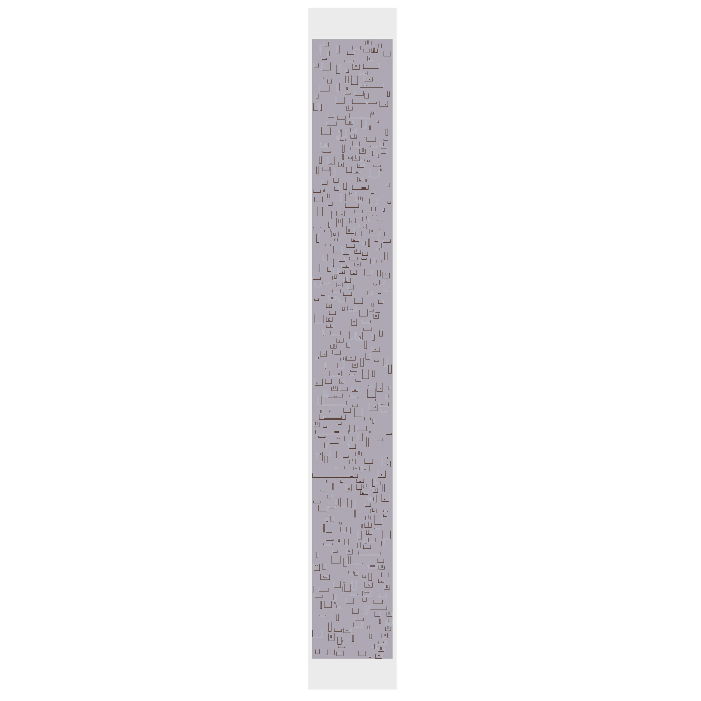
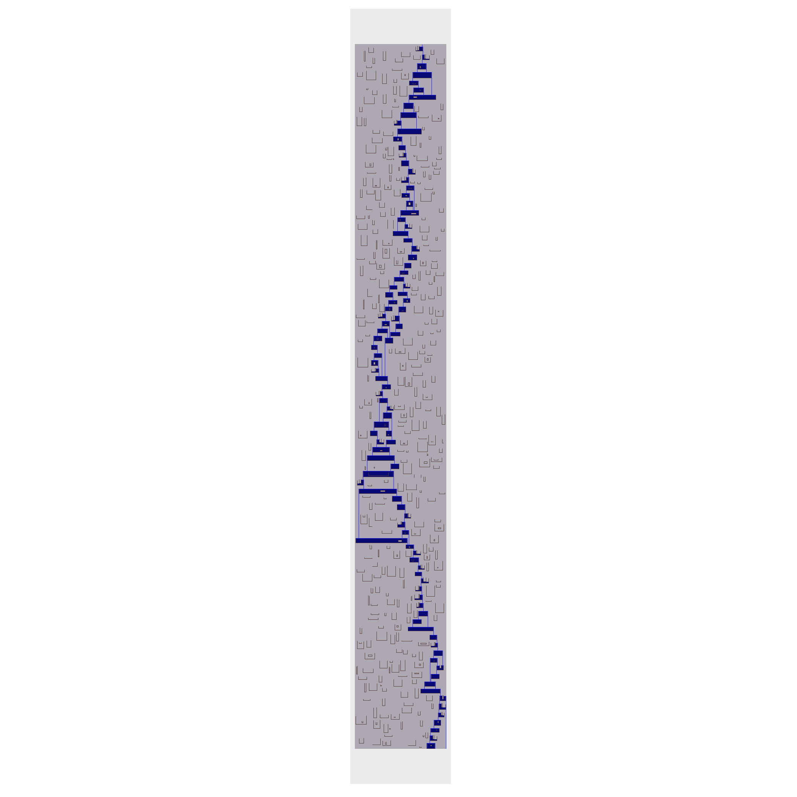

```{r setup, include=FALSE}
library(gifski)
library(gganimate)
library(ggplot2)
library(reshape2)
library(knitr)
library(dplyr)
library(stringr)
library(tidyverse)
library(readr)
library(collections)
options(scipen = 999)
```

```{r}
input<-read_lines("Day17Sample.txt")
```

Set up the clay
Going to use an actual matrix for the clay because I think I may need to be able to look left and right and - that's harder to do with a dictionary
```{r}
walls<-as.data.frame(matrix(ncol=2,nrow=0))
for(i in 1:length(input)){
  w<-input[i]
  wn<-as.numeric(unlist(str_split(str_remove_all(str_replace(w,"\\.\\."," "),"[^0-9| ]")," ")))
if(str_sub(w,1,1)=="x"){
    for(i in (wn[2]+1):(wn[3]+1)){
      walls<-rbind(walls,c(wn[1],i))}
  }else{
    for(i in wn[2]:wn[3]){
      walls<-rbind(walls,c(i,(wn[1]+1)))}}}

clay<-matrix(".",ncol=max(walls[,1])+1,nrow=max(walls[,2]))

for(i in 1:nrow(walls)){
  clay[walls[i,2],walls[i,1]]<-"#"}

### add the spring
clay[1,500]<-"+"

```


```{r}
clay[,494:507]

```


```{r,echo=FALSE}
watercolors<-c("."="#ADA8B3","#"="#553D36","+"="#CDE6F5","~"="#070974","v"="#181bf2")


cg<-melt(clay[,(min(walls[,1])-1):ncol(clay)])
startgraph<-ggplot()+
  geom_tile(data=cg,aes(x=Var2,y=Var1,fill=value))+
  scale_fill_manual(values=watercolors)+
  theme(axis.text.x = element_blank(),
        axis.ticks.x = element_blank(),
        axis.text.y = element_blank(),
        axis.ticks.y = element_blank(),
        axis.title.y = element_blank(),
        axis.title.x = element_blank(),
        panel.grid.major = element_blank(),
        panel.grid.minor = element_blank(),
        legend.position="none")+
  scale_y_reverse()+
  coord_fixed()
```
I give up and will try to flood fill this.

```{r}
### flowing water is "v" standing water is "~" (so, no special characters)
spillwater<-function(startx,starty,cl){
  pq<-priority_queue()
  #always deal with the lowest still doing things one first
  pq$push(c(startx,starty),starty)
  beenthere<-dict()
  while(pq$size()>0){
    curr<-pq$pop()
    currx<-curr[1]
    curry<-curr[2]
    ### stop if out of bounds
    if(curry>nrow(cl)|currx>ncol(cl)|currx<1){next}
    #### just pulling up, down, left, right, and center
    m<-cl[curry,currx]
    if(curry>1){u<-cl[curry-1,currx]}else{u<-"X"}
    if(curry<nrow(cl)){d<-cl[curry+1,currx]}else{d<-"X"}
    if(currx>1){l<-cl[curry,currx-1]}else{l<-"X"}
    if(currx<ncol(cl)){r<-cl[curry,currx+1]}else{r<-"X"}
    claydeps<-which(cl[curry,]=="#")
    leftlimit<-claydeps[which(claydeps<currx)]
    if(length(leftlimit)>0){leftlimit<-max(leftlimit)}
    rightlimit<-claydeps[which(claydeps>currx)]
    if(length(rightlimit>0)){rightlimit<-min(rightlimit)}
    ### if have been there with this exact configuration,
    ### stop and move to the next as not to have an infinite loop
    if(beenthere$has(c(currx,curry,m,u,d,l,r))){next}
    beenthere$set(c(currx,curry,m,u,d,l,r),c(currx,curry,m,u,d,l,r))
    ### just to make sure everything has been run, re-run it
    pq$push(c(currx,curry),curry-1)
    switch(m,
           ### if spring, flow down
           "+"={
             cl[curry+1,currx]<-"v"
             pq$push(c(currx,curry+1),curry+1)},
           ### if wall, do nothing
           "#"={next},
           ### if flowing
           "v"={
             ### if space below, flow down
             if(d=="."){
               cl[curry+1,currx]<-"v"
               pq$push(c(currx,curry+1),curry+1)
               next
               ### if at wall or standing water-
               }else if(d%in%c("#","~")){
               ### if it's blank out to the either end
                 if(length(leftlimit)==0||length(rightlimit)==0){
                   if(l=="."){cl[curry,currx-1]<-"v"
                   pq$push(c(currx-1,curry),curry)}
                   if(r=="."){cl[curry,currx+1]<-"v"
                   pq$push(c(currx+1,curry),curry)}
                   next}
                 ### if everything under is wall or standing water make standing
                 if(all(cl[curry+1,leftlimit:rightlimit]%in%c("#","~"))){
                   cl[curry,currx]<-"~"
                   if(l=="."){cl[curry,currx-1]<-"~"
                   pq$push(c(currx-1,curry),curry)}
                   if(r=="."){cl[curry,currx+1]<-"~"
                   pq$push(c(currx+1,curry),curry)}
                 }else{
                   if(l=="."){cl[curry,currx-1]<-"v"
                   pq$push(c(currx-1,curry),curry)}
                   if(r=="."){cl[curry,currx+1]<-"v"
                   pq$push(c(currx+1,curry),curry)}}}},
           ###push left, right, and up
           "~"={
             if(l%in%c(".","v")){cl[curry,currx-1]<-"~"
             pq$push(c(currx-1,curry),curry)}
             if(r%in%c(".","v")){cl[curry,currx+1]<-"~"
             pq$push(c(currx+1,curry),curry)}
             #####to check up, check to see if above is flowing, if so, push up
             if(u%in%c("v")){pq$push(c(currx,curry-1),curry-1)}},
           cat(m,"I do not know\n"))
  }
  mincl<-1
  while(all(cl[mincl,]!="#")){mincl<-mincl+1}
  
  allwater<-length(which(cl[mincl:nrow(cl),]=="~"))+length(which(cl[mincl:nrow(cl),]=="v"))
  list(allwater,cl)}
```

```{r}
endclay<-spillwater(500,1,clay)
part1<-endclay[[1]]
part1
```
## Part 2
Unless I'm crazy, part 2 is just the standing water -
```{r}
part2<-length(which(endclay[[2]]=="~"))
part2
```


```{r,echo=FALSE,eval=FALSE}
endmatrix<-endclay[[2]]
cg2<-melt(endmatrix[,(min(walls[,1])-2):ncol(clay)])
endgraph<-ggplot()+
  geom_tile(data=cg2,aes(x=Var2,y=Var1,fill=value))+
  scale_fill_manual(values=watercolors)+
  theme(axis.text.x = element_blank(),
        axis.ticks.x = element_blank(),
        axis.text.y = element_blank(),
        axis.ticks.y = element_blank(),
        axis.title.y = element_blank(),
        axis.title.x = element_blank(),
        panel.grid.major = element_blank(),
        panel.grid.minor = element_blank(),
        legend.position="none")+
  scale_y_reverse()+
  coord_fixed()

startgraph
endgraph
```
 


