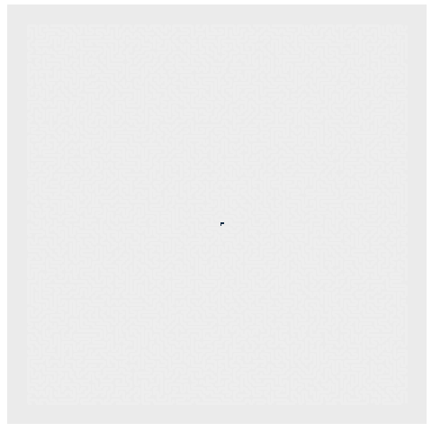

```{r setup, include=FALSE}
library(gganimate)
library(gifski)
library(ggplot2)
library(reshape2)
library(knitr)
library(dplyr)
library(stringr)
library(tidyverse)
library(readr)
library(collections)
options(scipen = 999)
```

```{r,eval=FALSE}
input<-read_lines("DATA")
```

## Part 1


It took forever to figure this out -

mapbuilder() takes in a path - the "out" is a dictionary with every point and the rooms it is connected to.

it parses through starting with the current coordinates, the rest of the path, how many "levels" (subpaths) deep it is (starting with 1):

* if the next step is a direction (N,E,W,S)
  +   connect the current to a step in that direction & vice versa
  +   make the next step the current step
  +   repeat
* if the next step is the start of a set of branches (open paren)
  +   store the current coordinate as the parent of all the branches in that level
  +   go down a level + keep going with the current coordinate & the next character in the path
  +   repeat
* if the next step is the end of the branch, but not the end of the set (pipe)
  +   store the current coordinate in a group of "branch ends" for that layer to pick up later
  +   pick up the parent of the branches and move forward with the next step in the path
  +   repeat
* if the next step is is the end of that set of branches (closed paren) + add the current to the list of "branch
ends"
  +   for all the branch ends in the level, start a new submap (stored in a stack) and repeat for each of them.
  +   clear the parent & list of ends for that level
  +   go up a level

Each submap has to hold its own level, parents (for all the levels), branch ends (for all levels) (That's what took me forever)

pathfinder is a simple search from the output of mapbuilder. It stops when it reaches every point. It spits out the distance from the start to each point (and the path) because I wanted a graph

```{r,eval=FALSE}
mapbuilder<-function(p){
  allpaths<-dict()
  q<-stack()
  beenthere<-dict()
  lvl<-1
  par<-vector(mode="list",length=1000)
  rjn<-vector(mode="list",length=1000)
  q$push(list(0,0,p,par,rjn,lvl))
  while(q$size()>0){
    pth<-q$pop()
    pthx<-pth[[1]]
    pthy<-pth[[2]]
    pthp<-pth[[3]]
    pthpr<-pth[[4]]
    pthrjn<-pth[[5]]
    pthlvl<-pth[[6]]
    fc<-str_sub(pthp,1,1)
    lstep<-c(pthx,pthy)
    pl<-paste(lstep[1],lstep[2])
    if(beenthere$has(paste(pthx,pthy,pthp))){next}else(beenthere$set(paste(pthx,pthy,pthp),0))
    if(is.na(pthp)){
      next}
    if(pthp==""){
      next}
    ### if the next thing is a direction, move in a direction
    if(fc%in%c("N","E","W","S")){
      switch(fc,
        "N"=nstep<-lstep+c(0,1),
        "E"=nstep<-lstep+c(1,0),
        "W"=nstep<-lstep+c(-1,0),
        "S"=nstep<-lstep+c(0,-1),
        cat("baddir\n"))
      npth<-str_sub(pthp,start=2)
      pl<-paste(lstep[1],lstep[2])
      pn<-paste(nstep[1],nstep[2])
      allpaths$set(pl,unique(c(allpaths$get(pl,c()),pn)))
      allpaths$set(pn,unique(c(allpaths$get(pn,c()),pl)))
      q$push(list(nstep[1],nstep[2],npth,pthpr,pthrjn,pthlvl))
      #### else if starting a set of branches
    }else if(fc=="("){
      ### make a new level
      pthlvl<-pthlvl+1
      ### add the parent coordinates
      pthpr[[pthlvl]]<-list(c(pthx,pthy))
      ### push the updated path with the current x&y
      q$push(list(pthx,pthy,str_sub(pthp,start=2),pthpr,pthrjn,pthlvl))
      ### if continuing the set of branches
    }else if(fc=="|"){
      ### add the current end to end
       pthrjn[[pthlvl]]<-c(pthrjn[[pthlvl]],list(lstep))
       ### push from the parent to what's next
      q$push(list(pthpr[[pthlvl]][[1]][1],pthpr[[pthlvl]][[1]][2],str_sub(pthp,start=2),pthpr,pthrjn,pthlvl))
      ### if ending the branch set
    }else if(fc==")"){
      ### add current end to rjn:
      pthrjn[[pthlvl]]<-c(pthrjn[[pthlvl]],list(lstep))
      pthrjn[[pthlvl]]<-unique(pthrjn[[pthlvl]])
      ###
      ### push all of the rjn
      if(length(pthrjn[[pthlvl]])>0){
        nxtlvl<-pthlvl-1
        nxtpr<-pthpr
        nxtpr[[pthlvl]]<-list()
        nxtjn<-pthrjn
        nxtjn[[pthlvl]]<-list()
        for(i in 1:length(pthrjn[[pthlvl]])){
          q$push(list(pthrjn[[pthlvl]][[i]][1],pthrjn[[pthlvl]][[i]][2],str_sub(pthp,start=2),nxtpr,nxtjn,nxtlvl))}}
      ### clear the parent & rjn
    }else(cat("I don't know what happened here\n"))
    }
  allpaths}

```

```{r,eval=FALSE}
pathfinder<-function(mp){
  strt<-list(paste(0,0),paste(0,0),0)
  pq<-priority_queue()
  beenthere<-dict()
  pq$push(strt,0)
  while(pq$size()>0){
    curr<-pq$pop()
    currpos<-curr[[1]]
    currpth<-curr[[2]]
    currstp<-curr[[3]]
    if(beenthere$has(currpos)){next}else{beenthere$set(currpos,curr)}
    nxts<-mp$get(currpos)
    for(i in 1:length(nxts)){
      pq$push(list(nxts[i],str_c(currpth,";",nxts[i]),currstp+1),-currstp-1)}}
  btl<-beenthere$as_list()
  btdf<-as.data.frame(matrix(ncol=3,nrow=0))
  for(i in 1:length(btl)){btdf<-rbind(btdf,unlist(btl[[i]]))}
  colnames(btdf)<-c("coord","pth","steps")
  btdf$steps<-as.numeric(as.character(btdf$steps))
  cat(max(btdf$steps,"\n"))
  btdf}
```

```{r,eval=FALSE}
p1<-mapbuilder(str_sub(input,2,-2))
ppth<-pathfinder(p1)
part1<-max(ppth$steps)
part1
```

## Part 2 -

Because I output and kept the list of all points & the steps to that point, here:

```{r,eval=FALSE}
part2<-ppth %>% rowwise %>% filter(steps>=1000)
part2<-nrow(part2)
part2

```

Graph:



```{r,eval=FALSE,echo=FALSE}
grphlns<-as.data.frame(matrix(nrow=0,ncol=4))
grlnl<-p1$as_list()
for(i in 1:length(grlnl)){
  a<-as.numeric(unlist(str_split(names(grlnl[i])," ")))
  for(j in 1:length(grlnl[[i]])){
  b<-as.numeric(unlist(str_split(grlnl[[i]][j]," ")))
  c<-c(a,b)
  grphlns<-rbind(grphlns,c)}}
colnames(grphlns)<-c("x1","y1","x2","y2")
```

```{r,eval=FALSE,echo=FALSE}

grphpts<-ppth %>% rowwise %>% select(-pth)%>%
  mutate(x=as.numeric(unlist(str_split(coord," "))[1]),
         y=as.numeric(unlist(str_split(coord," "))[2]))
```

```{r,eval=FALSE,echo=FALSE}
lngst<-ppth$pth[which(ppth$steps==max(ppth$steps))]
lngst<-unlist(str_split(lngst,";"))
```

```{r,eval=FALSE,echo=FALSE}
lngdf<-as.data.frame(matrix(nrow=0,ncol=5))
for(i in 1:(length(lngst)-1)){
  a<-as.numeric(unlist(str_split(lngst[i]," ")))
  b<-as.numeric(unlist(str_split(lngst[i+1]," ")))
  c<-c(a,b,i)
lngdf<-rbind(lngdf,c)}
colnames(lngdf)<-c("x1","y1","x2","y2","steps")
```

```{r,eval=FALSE,echo=FALSE}
basicgraph<-ggplot()+
  theme(axis.text.x = element_blank(),
        axis.ticks.x = element_blank(),
        axis.text.y = element_blank(),
        axis.ticks.y = element_blank(),
        axis.title.y = element_blank(),
        axis.title.x = element_blank(),
        panel.grid.major = element_blank(),
        panel.grid.minor = element_blank(),
        legend.position="none")+
  coord_fixed()
```

```{r,eval=FALSE,echo=FALSE}
bg2<-basicgraph+geom_tile(data=grph,aes(x=x,y=y,fill=steps))+
  geom_segment(data=grphlns,aes(x=x1,y=y1,xend=x2,yend=y2),color="#eeeeee",size=1.2)+
  geom_segment(data=lngdf,aes(x=x1,y=y1,xend=x2,yend=y2),color="#FF0000",size=.6)
bg2
```

```{r,eval=FALSE,echo=FALSE}
bganimbase<-bg2+
  transition_states(steps,wrap=FALSE)+
  shadow_mark()
bganim<-animate(bganimbase,nframes=400,fps=20,renderer = gifski_renderer(),end_pause=15)

bganim
```

```{r,eval=FALSE,echo=FALSE}
anim_save("day20.gif",bganim)
```


