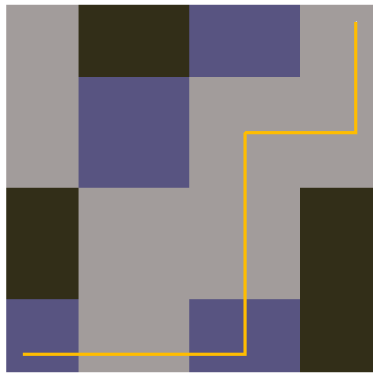

```{r setup, include=FALSE}
library(gganimate)
library(gifski)
library(ggplot2)
library(reshape2)
library(knitr)
library(dplyr)
library(stringr)
library(tidyverse)
library(readr)
library(collections)
options(scipen = 999)
```


## Part 1

```{r}
#### stupid 0 indexing
findgi<-function(x,y,tx,ty,d){
  gi<-matrix(ncol=x+1,nrow=y+1)
  el<-matrix(ncol=x+1,nrow=y+1)
  t<-matrix(ncol=x+1,nrow=y+1)
  for(i in 1:(y+1)){
    for(j in 1:(x+1)){
      if(i==1&j==1){
        gi[i,j]<-0
        el[i,j]<-(gi[i,j]+d)%%20183
        t[i,j]<-el[i,j]%%3
      }else if(i==ty+1&j==tx+1){
        gi[i,j]<-0
        el[i,j]<-(gi[i,j]+d)%%20183
        t[i,j]<-el[i,j]%%3
      }else if(i==1){
        gi[i,j]<-(j-1)*16807
        el[i,j]<-(gi[i,j]+d)%%20183
        t[i,j]<-el[i,j]%%3
      }else if(j==1){
        gi[i,j]<-(i-1)*48271
        el[i,j]<-(gi[i,j]+d)%%20183
        t[i,j]<-el[i,j]%%3
      }else{
        gi[i,j]<-el[(i-1),j]*el[i,(j-1)]
        el[i,j]<-(gi[i,j]+d)%%20183
        t[i,j]<-el[i,j]%%3}
      }}
list(gi,el,t)}
```


```{r}
p1<-findgi(16,16,10,10,510)

part1<-sum(p1[[3]][1:11,1:11])
part1
```

```{r}
p<-p1[[3]]
p[which(p==0)]<-"."
p[which(p=="1")]<-"="
p[which(p=="2")]<-"|"


for(a in 1:16){
  cat(str_squish(str_flatten(p[a,])),"\n")
}

```


## Part 2
Basic pathfinding search - 


```{r}
#0 is rocky - C & T
#1 is wet - C & N
#2 is narrow - T & N

rescue<-function(tx,ty,d){
  ## make the cave system twice as big as it needs to be - just in case
  mz<-findgi(80,1000,tx,ty,d)[[3]]
  pq<-priority_queue()
  beenthere<-dict()
  ### the queue will be x,y,tool,minutes
  pq$push(list(1,1,"T",paste(1,1,"T"),0),0)
  cnt<-0
  while(pq$size()>0){
    curr<-pq$pop()
    currx<-curr[[1]]
    curry<-curr[[2]]
    currt<-curr[[3]]
    currpth<-curr[[4]]
    currm<-curr[[5]]
    if(currx==(tx+1)&&curry==(ty+1)&currt=="T"){
      cat(currm,"\n")
      return(curr)}
    if(beenthere$has(paste(currx,curry,currt))){next}
    beenthere$set(paste(currx,curry,currt),currm)
    ### change tools
    currtype<-mz[curry,currx]
    absnow<-sum(abs(c(tx+1,ty+1)-c(currx,curry)))
    if(currt!="T"&&(currtype==0||currtype==2)){pq$push(list(currx,curry,"T",str_c(currpth,";",paste(currx,curry,"T",currtype)),currm+7),-currm-7-absnow)}
    if(currt!="N"&&(currtype==1||currtype==2)){pq$push(list(currx,curry,"N",str_c(currpth,";",paste(currx,curry,"N",currtype)),currm+7),-currm-7-absnow-7)}
    if(currt!="C"&&(currtype==1||currtype==0)){pq$push(list(currx,curry,"C",str_c(currpth,";",paste(currx,curry,"C",currtype)),currm+7),-currm-7-absnow-7)}
    ### up
    if(curry>1){
      u<-mz[curry-1,currx]
      absu<-sum(abs(c(tx+1,ty+1)-c(currx,curry-1)))
      if(currt!="T"){absu<-absu+7}
      if(u==0 && (currt=="C"||currt=="T")){pq$push(list(currx,curry-1,currt,str_c(currpth,";",paste(currx,curry-1,currt,u)),currm+1),-currm-1-absu)
      }else if(u==1 && (currt=="N"||currt=="C")){pq$push(list(currx,curry-1,currt,str_c(currpth,";",paste(currx,curry-1,currt,u)),currm+1),-currm-1-absu)
      }else if(u==2 && (currt=="T"||currt=="N")){pq$push(list(currx,curry-1,currt,str_c(currpth,";",paste(currx,curry-1,currt,u)),currm+1),-currm-1-absu)}}
    ### down
    if(curry<nrow(mz)){
      d<-mz[curry+1,currx]
      absd<-sum(abs(c(tx+1,ty+1)-c(currx,curry+1)))
      if(currt!="T"){absd<-absd+7}
      if(d==0 && (currt=="C"||currt=="T")){pq$push(list(currx,curry+1,currt,str_c(currpth,";",paste(currx,curry+1,currt,d)),currm+1),-currm-1-absd)
      }else if(d==1 && (currt=="N"||currt=="C")){pq$push(list(currx,curry+1,currt,str_c(currpth,";",paste(currx,curry+1,currt,d)),currm+1),-currm-1-absd)
      }else if(d==2 && (currt=="T"||currt=="N")){pq$push(list(currx,curry+1,currt,str_c(currpth,";",paste(currx,curry+1,currt,d)),currm+1),-currm-1-absd)}}
    ### left
    if(currx>1){
      l<-mz[curry,currx-1]
      absl<-sum(abs(c(tx+1,ty+1)-c(currx-1,curry)))
      if(currt!="T"){absl<-absl+7}
      if(l==0 && (currt=="C"||currt=="T")){pq$push(list(currx-1,curry,currt,str_c(currpth,";",paste(currx-1,curry,currt,l)),currm+1),-currm-1-absl)
      }else if(l==1 && (currt=="N"||currt=="C")){pq$push(list(currx-1,curry,currt,str_c(currpth,";",paste(currx-1,curry,currt,l)),currm+1),-currm-1-absl)
      }else if(l==2 && (currt=="T"||currt=="N")){pq$push(list(currx-1,curry,currt,str_c(currpth,";",paste(currx-1,curry,currt,l)),currm+1),-currm-1-absl)}}
    ### right
    if(currx<ncol(mz)){
      r<-mz[curry,currx+1]
      absr<-sum(abs(c(tx+1,ty+1)-c(currx+1,curry)))
      if(currt!="T"){absr<-absr+7}
      if(r==0 && (currt=="C"||currt=="T")){pq$push(list(currx+1,curry,currt,str_c(currpth,";",paste(currx+1,curry,currt,r)),currm+1),-currm-1-absr)
      }else if(r==1 && (currt=="N"||currt=="C")){pq$push(list(currx+1,curry,currt,str_c(currpth,";",paste(currx+1,curry,currt,r)),currm+1),-currm-1-absr)
      }else if(r==2 && (currt=="T"||currt=="N")){pq$push(list(currx+1,curry,currt,str_c(currpth,";",paste(currx+1,curry,currt,r)),currm+1),-currm-1-absr)}}
    cnt<-cnt+1}
  beenthere}
```


```{r}
p2<-rescue(10,10,510)
part2<-p2[[5]]
part2
```


```{r,echo=FALSE,eval=FALSE}
finalpath<-unlist(str_split(p2[[4]],";"))
fpg<-as.data.frame(matrix(ncol=4,nrow=0))
for(i in 1:length(finalpath)){
  l<-unlist(str_split(finalpath[i]," "))
  l<-append(l[1:3],i)
  fpg<-rbind(fpg,l)
}
colnames(fpg)<-c("x","y","t","m")
fpg$x<-as.numeric(fpg$x)
fpg$y<-as.numeric(fpg$y)
fpg$m<-as.numeric(fpg$m)
fpg<-fpg%>%mutate(g=1)

bckgrnd<-melt(findgi(max(fpg$x+2),max(fpg$y+2),6,797,11991)[[3]])
bckgrnd$value<-as.character(bckgrnd$value)
```


```{r,echo=FALSE,eval=FALSE}

toolcolors<-c("T"="#FFBD00","N"="#EEEEFF","C"="#88FF88")
regioncolors<-c("0"="#A29C9B","1"="#322E18","2"="#585481")

basicgraph<-ggplot()+
  geom_tile(data=bckgrnd,aes(x=Var2,y=Var1,fill=value))+
  geom_point(aes(x=7,y=798),color="red",size=1)+
  geom_point(aes(x=1,y=1),color="white",size=1)+
  scale_fill_manual(values=regioncolors)+
  scale_color_manual(values=toolcolors)+
  
  theme(axis.text.x = element_blank(),
        axis.ticks.x = element_blank(),
        axis.text.y = element_blank(),
        axis.ticks.y = element_blank(),
        axis.title.y = element_blank(),
        axis.title.x = element_blank(),
        panel.grid.major = element_blank(),
        panel.grid.minor = element_blank(),
        legend.position="none")+
  scale_y_reverse()+
  coord_fixed()
basicgraph


twentytwo<-basicgraph+
  geom_path(data=fpg,aes(x=x,y=y,color=t,group=g),size=1.5)+
  transition_reveal(m)+
  view_follow()
  
twentytwoanim<-animate(twentytwo,renderer = gifski_renderer(),end_pause=15)
twentytwoanim
anim_save("Day22.gif",twentytwoanim)
```

For reasons that are not even remotely clear to me, this shows up flipped on the x axis.  But that's the path.
