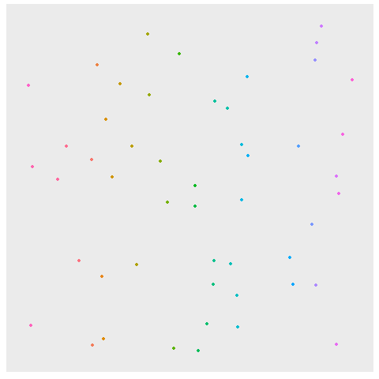

```{r setup, include=FALSE}
library(gifski)
library(gganimate)
library(ggplot2)
library(reshape2)
library(knitr)
library(dplyr)
library(stringr)
library(tidyverse)
library(readr)
library(collections)
options(scipen = 999)
```

```{r}
input<-read_lines("Day6Sample.txt")
#input<-read_lines("../../AoCData/AOC2018/Day6.txt")

```

## Part 1

I think I can try a flood fill.   Fill out to the border +5
Return a dictionary of all points in the list and their closest starting point
```{r}

closestpoint<-function(coords){
  beenthere<-dict()
  q<-priority_queue()
  maxx<- -Inf
  maxy<- -Inf
  minx<- Inf
  miny<- Inf
  ### for each point in coords
  for(i in 1:length(coords)){
    crd<-as.numeric(unlist(str_split(coords[i],",")))
    ### adjust the boundaries
    maxx<-max(crd[1],maxx)
    maxy<-max(crd[2],maxy)
    minx<-min(crd[1],minx)
    miny<-min(crd[2],miny)
    ### add this to the queue in x,y,paste(xy),mandist
    q$push(c(crd[1],crd[2],paste(crd[1],crd[2]),0),0)}
  ## push the borders
  maxx<-maxx+5
  maxy<-maxy+5
  minx<-minx-5
  miny<-miny-5
  ### while there's a queue
  
  while(q$size()>0){
    ### get the point details
    curr<-q$pop()
    currx<-as.numeric(curr[[1]])
    curry<-as.numeric(curr[[2]])
    currbase<-curr[[3]]
    currbasecoord<-as.numeric(unlist(str_split(currbase," ")))
    currmd<-sum(abs(c(currbasecoord[1],currbasecoord[2])-c(currx,curry)))
    ### if over the edges, next
    if(currx<minx|curry<miny|currx>maxx|curry>maxy){next}
    ### if been there before
    if(beenthere$has(paste(currx,curry))){
      ### check to see if there's a match for the number of steps
      if(beenthere$get(paste(currx,curry))[[2]]==currmd&&beenthere$get(paste(currx,curry))[[1]]!=currbase){
        #cat(currx,curry,currbase,currmd,"\n")
        beenthere$set(paste(currx,curry),list("tie",currmd))}
      ### either way
      next}
    ### mark as having been there
    beenthere$set(paste(currx,curry),list(currbase,currmd))
    ### add the directions in all 4 ways
    ##up
    q$push(c(currx,curry+1,currbase,currmd+1),-currmd-1)
    ##down
    q$push(c(currx,curry-1,currbase,currmd+1),-currmd-1)
    ##left
    q$push(c(currx-1,curry,currbase,currmd+1),-currmd-1)
    ##right
    q$push(c(currx+1,curry,currbase,currmd+1),-currmd-1)}
  beenthere}


```


```{r}
a<-closestpoint(input)
```


Take in the dictionary and then find the smallest that isn't on a border (and therefore infinite)
```{r}
largestarea<-function(btdict){
  gs<-as.data.frame(matrix(ncol=4,nrow=0))
  btdict<-btdict$as_list()
  cat(length(btdict),"\n")
  for(i in 1:length(btdict)){
    pt<-btdict[i]
    xy<-as.numeric(unlist(str_split(names(pt)," ")))
    ptbase<-unlist(pt[[1]][1])
    ptdist<-unlist(pt[[1]][2])
    gs<-rbind(gs,list(xy[1],xy[2],ptbase,ptdist))}
  colnames(gs)<-c("x","y","closest","dist")
  oldgs<-gs
  ### find borders
  minx<-min(gs$x)
  miny<-min(gs$y)
  maxx<-max(gs$x)
  maxy<-max(gs$y)
  brdrs<-gs%>%rowwise%>%ungroup%>%
    filter(x==maxx|x==minx|y==maxy|y==miny)%>%
    select(closest)
  brdrs<-unique(unlist(brdrs))
  gs<-gs %>% rowwise %>%
    mutate(brdrtch=!closest%in%brdrs)%>%
    filter(brdrtch)%>%count(closest)%>%
    arrange(n)
  
list(oldgs,gs)}
```


```{r}
another<-largestarea(a)

another[[2]]

```
```{r}
part1<-another[[2]][nrow(another[[2]]),]$n
part1
```

```{r,echo=FALSE,message=FALSE,eval=FALSE}
gr<-another[[1]]%>%rowwise%>%
  filter(closest!="tie")
basicgraph<-ggplot(data=gr,aes(x=x,y=y,color=closest))+
  geom_point()+
  theme(axis.text.x = element_blank(),
        axis.ticks.x = element_blank(),
        axis.text.y = element_blank(),
        axis.ticks.y = element_blank(),
        axis.title.y = element_blank(),
        axis.title.x = element_blank(),
        panel.grid.major = element_blank(),
        panel.grid.minor = element_blank(),
        legend.position="none")+
  scale_y_reverse()+
  coord_fixed()
basicgraph
p1anim<-basicgraph+
  transition_states(dist)+
  shadow_mark()
day6p1anim<-animate(p1anim,nframes=87,renderer = gifski_renderer(),end_pause=15)
day6p1anim
```
```{r,echo=FALSE,message=FALSE,eval=FALSE}
#anim_save("day6part1.gif",day6p1anim)
```




## Part 2

I feel like this is a different flood fill - starting from the center of the points (average x, average y)

```{r}
battenthousand<-function(coords,lmt){
  ## change to numberpairs
  coords<-lapply(coords,function(x){
    x<-as.numeric(unlist(str_split(x,",")))
  x})
  startx<-0
  starty<-0
  for(i in 1:length(coords)){
    startx<-startx+coords[[i]][1]
    starty<-starty+coords[[i]][2]}
  startx<-startx%/%length(coords)
  starty<-starty%/%length(coords)
  beenthere<-dict()
  pq<-priority_queue()
  pq$push(c(startx,starty),0)
  while(pq$size()>0){
    curr<-pq$pop()
    currx<-curr[1]
    curry<-curr[2]
    ## if already done this coordinate
    if(beenthere$has(paste(currx,curry))){next}
    ## find the manhattan distance. If > limit next
    currmd<-sum(sapply(coords,function(x){
      x<-sum(abs(x-c(currx,curry)))
    x}))
    if(currmd>=lmt){next}
    beenthere$set(paste(currx,curry),currmd)
    pq$push(c(currx+1,curry),-currmd)
    pq$push(c(currx-1,curry),-currmd)
    pq$push(c(currx,curry+1),-currmd)
    pq$push(c(currx,curry-1),-currmd)}
beenthere}
```

```{r}
under<-battenthousand(input,10000)
part2<-under$size()
part2
```
